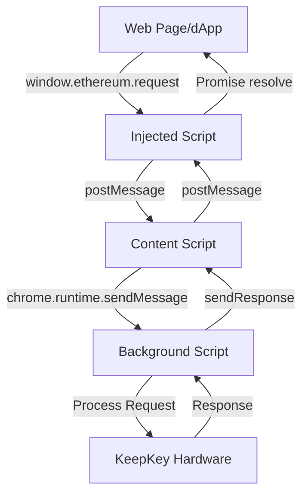

# JavaScript Injection Architecture Documentation

## Current Implementation Overview

The KeepKey extension uses a multi-layer injection system to provide wallet functionality to web pages. This document details the current architecture, communication flow, and identified reliability issues.

## Architecture Layers

### 1. Manifest Declaration (`chrome-extension/manifest.js`)
```javascript
content_scripts: [
  {
    matches: ['http://*/*', 'https://*/*', '<all_urls>'],
    js: ['content/index.iife.js'],
    run_at: 'document_start',  // Critical timing issue #1
  },
  {
    matches: ['http://*/*', 'https://*/*', '<all_urls>'],
    js: ['content-ui/index.iife.js'],
    // No run_at specified - defaults to 'document_idle' (timing issue #2)
  }
]
```

### 2. Content Script (`pages/content/src/index.ts`)
- Runs in isolated context with access to Chrome APIs
- Creates and injects `injected.js` into the page's DOM
- Acts as message bridge between page and background script

### 3. Injected Script (`chrome-extension/public/injected.js`)
- Runs in page context with direct access to `window` object
- Creates wallet provider objects (`window.ethereum`, `window.xfi`, `window.keepkey`)
- Implements EIP-6963 provider announcement
- Version: 1.0.17

## Communication Flow



## Detailed Flow Analysis

### 1. Injection Process
```javascript
// Content script injects the provider script
const script = document.createElement('script');
script.src = chrome.runtime.getURL('injected.js');
script.onload = function() { this.remove(); };  // Self-cleaning
(document.head || document.documentElement).appendChild(script);
```

### 2. Message Passing Protocol

#### Request Flow:
1. **dApp → Injected Script**: Direct method call (e.g., `ethereum.request()`)
2. **Injected Script → Content Script**: `window.postMessage` with structure:
   ```javascript
   {
     source: 'keepkey-injected',
     type: 'WALLET_REQUEST',
     requestId: number,
     requestInfo: {
       id, method, params, chain, siteUrl, 
       scriptSource, version, requestTime, ...metadata
     }
   }
   ```
3. **Content Script → Background**: `chrome.runtime.sendMessage`
4. **Background Processing**: Routes to appropriate chain handler

#### Response Flow:
Reverse path with `WALLET_RESPONSE` type messages

## Identified Reliability Issues

### 🚨 Critical Issues

#### 1. Race Condition at Page Load
**Problem**: Content script runs at `document_start` but injected script may not be ready when dApp initializes
**Impact**: dApps fail to detect wallet provider
**Current Mitigation**: Multiple mount attempts (lines 318-323 in injected.js)
```javascript
mountWallet();
if (document.readyState === 'complete' || document.readyState === 'interactive') {
    mountWallet();  // Duplicate call - inefficient
} else {
    document.addEventListener('DOMContentLoaded', mountWallet);
}
```

#### 2. No Injection Verification
**Problem**: No way to confirm successful injection from content script
**Impact**: Silent failures when injection fails

#### 3. Global Namespace Pollution
**Problem**: Direct modification of `window` object without proper isolation
**Impact**: Conflicts with other extensions/scripts

#### 4. Message Queue Management
**Problem**: Basic queue implementation without timeout or overflow handling
```javascript
const messageQueue = [];  // Unbounded growth potential
```

### ⚠️ Moderate Issues

#### 5. Synchronous Request Handling
**Problem**: `sendRequestSync` function doesn't actually work synchronously
**Impact**: Incompatible with legacy dApps expecting sync responses

#### 6. Error Handling Gaps
- No retry mechanism for failed injections
- Callbacks can be orphaned if responses never arrive
- No cleanup for stale callbacks

#### 7. Version Mismatch Detection
**Problem**: No mechanism to detect/handle version mismatches between components
**Current Version**: 1.0.17 hardcoded in injected.js

#### 8. Duplicate Prevention Logic
```javascript
if (window.keepkeyInjected) return;  // Too simplistic
window.keepkeyInjected = true;
```
**Issue**: Can be bypassed, doesn't handle reload scenarios properly

### 📊 Performance Issues

#### 9. Multiple Injection Points
- Three separate content scripts loaded
- Shadow DOM created for UI components (overhead)
- Multiple event listeners without cleanup

#### 10. Inefficient Provider Creation
- Creates wallet objects for all chains even if unused
- No lazy loading mechanism

## Security Concerns

### 1. Unrestricted Message Passing
- Uses `'*'` for postMessage targetOrigin
- No origin validation in message handlers

### 2. Information Leakage
Extensive metadata collection in requests:
```javascript
requestInfo: {
  siteUrl, referrer, href, userAgent, 
  platform, language  // Privacy concerns
}
```

### 3. Configuration Exposure
```javascript
const userOverrideSetting = true;  // Hardcoded, should be configurable
```

## Recommendations for Redesign

### Immediate Improvements
1. **Add injection confirmation mechanism**
   - Content script should verify injection success
   - Implement retry logic with exponential backoff

2. **Improve race condition handling**
   - Use MutationObserver to detect when to inject
   - Implement proper ready state management

3. **Add message validation**
   - Validate origin and source
   - Add message schema validation

### Architecture Redesign
1. **Use declarative injection** when possible (web_accessible_resources)
2. **Implement proper state machine** for injection lifecycle
3. **Add telemetry** for injection success/failure rates
4. **Create abstraction layer** for multi-chain support
5. **Implement connection pooling** for message passing

### Code Quality
1. **TypeScript migration** for injected.js
2. **Unit tests** for injection logic
3. **Integration tests** for dApp compatibility
4. **Performance monitoring** for injection timing

## Testing Scenarios

Critical test cases for reliable injection:
1. Fast page loads (cached resources)
2. Slow page loads (large assets)
3. Single-page applications (React, Vue, Angular)
4. Page refreshes and navigation
5. Multiple tabs simultaneously
6. Extension update/reload scenarios
7. Conflicting wallet extensions
8. CSP-restricted pages